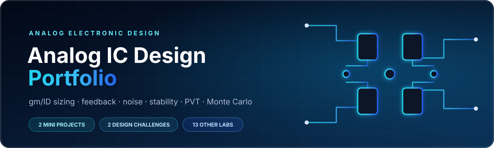
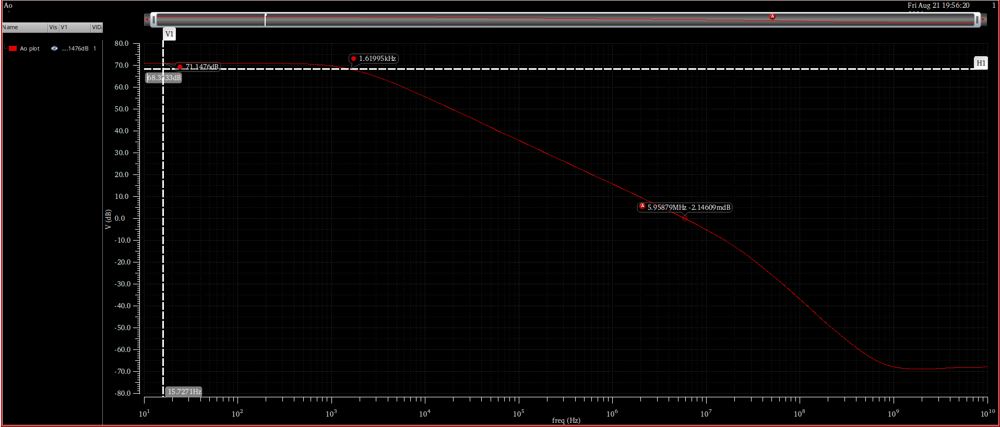
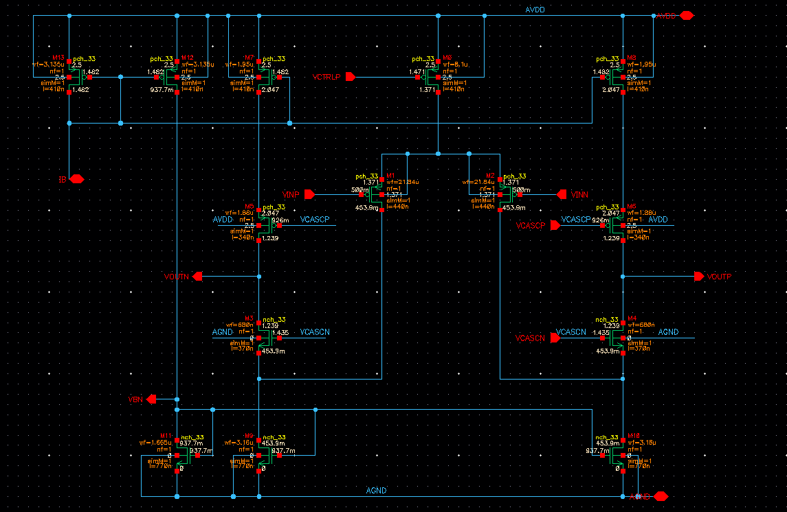
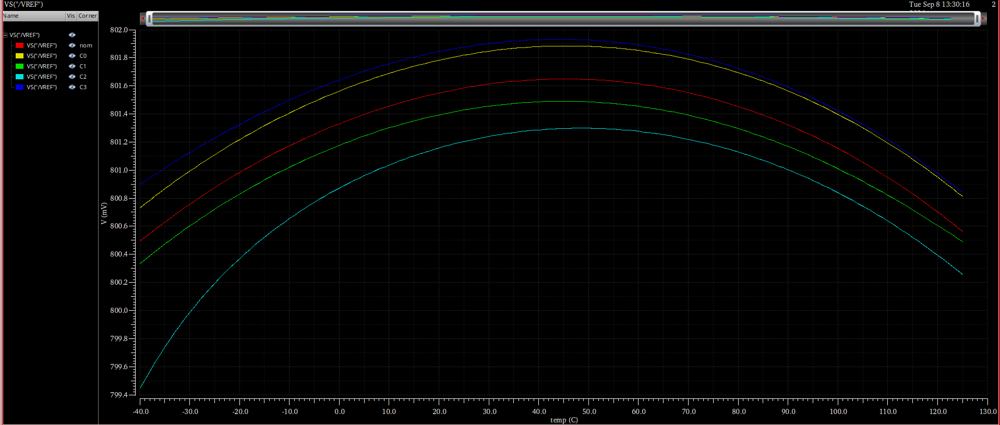

  

  
  
  
  

  <a href="https://marwan-negm.github.io/analog-ic-design-portfolio/"><strong>Explore the interactive portfolio →</strong></a>

  <a href="#mini-projects">Mini projects</a> ·
  <a href="#design-challenges">Design challenges</a> ·
  <a href="#other-labs">Other labs</a> ·
  <a href="docs/RESULTS.md">Detailed results</a> ·
  <a href="reports/README.md">All reports</a>

## Overview

The [live website](https://marwan-negm.github.io/analog-ic-design-portfolio/) is hosted publicly on GitHub Pages, with featured designs, an interactive results explorer, and a [separate lab archive](https://marwan-negm.github.io/analog-ic-design-portfolio/labs/). No sign-in is required.

This repository is a curated analog integrated-circuit design portfolio organized around two OTA mini projects and two advanced design challenges, supported by thirteen transistor-level labs. The work spans MOS characterization, amplifiers, current mirrors, feedback, noise, stability, common-mode control, a self-biased sub-1 V bandgap reference, and a rail-to-rail class-AB op amp.

The portfolio emphasizes the full engineering loop:

- gm/ID- and small-signal-based hand design
- transistor sizing and operating-point verification
- AC, transient, noise, stability, corner, and Monte Carlo simulation
- quantitative comparison between analysis and simulation
- clear technical reporting

> All headline values below are simulation results, not silicon measurements. Values were source-checked against the linked reports, plots, or simulator logs; the simulations were not rerun for this portfolio.

## Mini projects

The mini projects demonstrate the complete OTA design loop: specification allocation, gm/ID sizing, operating-point closure, frequency compensation, stability analysis, and transient verification.

| Mini project | Architecture | Selected simulated results | Evidence |
|---|---|---|---|
| **01 - [Two-stage Miller-compensated OTA](projects/two-stage-miller-ota/README.md)** | Differential first stage, common-source second stage, Miller compensation | 71.15 dB gain, 6.126 MHz GBW, 75.23 degree phase margin, 5.08 V/us slew rate | [Project page](projects/two-stage-miller-ota/README.md) · [PDF report](reports/cadence/09-two-stage-miller-ota.pdf) |
| **02 - [Fully differential folded-cascode OTA](projects/fully-differential-folded-cascode-ota/README.md)** | Folded-cascode signal path with transistor-level CMFB | 71.05 dB open-loop gain, 57.00 MHz GBW, 82.02 degree phase margin, 99.27 ns settling | [Project page](projects/fully-differential-folded-cascode-ota/README.md) · [PDF report](reports/cadence/11-fully-differential-folded-cascode-ota.pdf) |

## Design challenges

| Design challenge | Scope | Selected simulated results | Evidence |
|---|---|---|---|
| **01 - [Self-biased sub-1 V bandgap reference](projects/bandgap-reference/README.md)** | PTAT/CTAT synthesis, transistor OTA, startup, corners, and PDK passives | Part 2: approximately 0.8016 V, 2.5 mV global peak-to-peak spread, 65.7 to 78.5 degree phase margin; Part 3: approximately 0.8036 V and 3.25 mV global spread | [Project page](projects/bandgap-reference/README.md) · [PDF report](projects/bandgap-reference/report.pdf) |
| **02 - [Rail-to-rail Monticelli class-AB op amp](projects/rail-to-rail-class-ab-op-amp/README.md)** | Complementary input stages, translinear-loop biasing, class-AB output | Latest nominal log: 10.11 MHz GBW and 60.58 degree phase margin; separate plot: approximately 88.9 dB low-frequency loop gain | [Project page](projects/rail-to-rail-class-ab-op-amp/README.md) · [Compiled PDF report](projects/rail-to-rail-class-ab-op-amp/report.pdf) |

The Class-AB report is an evidence reconstruction from archived screenshots and simulator logs. It is explicitly scoped as preliminary nominal verification.

For full analytical-versus-simulation tables and result provenance, see [Detailed Results](docs/RESULTS.md).

## Selected evidence

<table>
  <tr>
    <td width="50%"></td>
    <td width="50%"></td>
  </tr>
  <tr>
    <td align="center"><strong>Mini Project 01</strong> Two-stage Miller OTA open-loop response</td>
    <td align="center"><strong>Mini Project 02</strong> Fully differential folded-cascode topology</td>
  </tr>
  <tr>
    <td width="50%"></td>
    <td width="50%"></td>
  </tr>
  <tr>
    <td align="center"><strong>Design Challenge 01</strong> Bandgap Part 2 temperature/corner sweep</td>
    <td align="center"><strong>Design Challenge 02</strong> Nominal Class-AB loop gain</td>
  </tr>
</table>

## Other labs

Thirteen supporting reports build the device-level and circuit-analysis foundations used in the four featured designs. Original lab numbers are retained as authored.

### Cadence Virtuoso / Spectre

| Lab | Topic | Report |
|---:|---|---|
| 1 | Low-pass filter and MOSFET characterization | [PDF](reports/cadence/01-lpf-and-mosfet-characterization.pdf) |
| 2 | gm/ID sizing and common-source amplifier | [PDF](reports/cadence/02-gmid-and-common-source-amplifier.pdf) |
| 3 | Cascode amplifier for gain | [PDF](reports/cadence/03-cascode-for-gain.pdf) |
| 8 | Negative feedback with behavioral and transistor-level OTAs | [PDF](reports/cadence/08-negative-feedback.pdf) |
| 10 | AC and transient noise analysis | [PDF](reports/cadence/10-noise-analysis.pdf) |

### Xschem / ngspice

| Lab | Topic | Report |
|---:|---|---|
| Prelab | Parallel and series RLC resonance | [PDF](reports/xschem/00-rlc-resonance-prelab.pdf) |
| 1 | MOS transconductance and output resistance | [PDF](reports/xschem/01-mos-small-signal-parameters.pdf) |
| 2 | Gain linearization with negative feedback | [PDF](reports/xschem/02-gain-linearization.pdf) |
| 3 | Cascode amplifier for bandwidth | [PDF](reports/xschem/03-cascode-for-bandwidth.pdf) |
| 4 | Common-drain amplifier | [PDF](reports/xschem/04-common-drain-amplifier.pdf) |
| 5 | Simple and wide-swing cascode current mirrors | [PDF](reports/xschem/05-current-mirror-comparison.pdf) |
| 6 | Differential amplifier | [PDF](reports/xschem/06-differential-amplifier.pdf) |
| 7 | 5-transistor OTA | [PDF](reports/xschem/07-five-transistor-ota.pdf) |

Browse the compact [report index](reports/README.md) for the complete 17-report collection.

## Repository structure

~~~text
.
|-- assets/                         # Curated schematics and simulation plots
|-- data/current-mirror-monte-carlo # Two 200-run CSV datasets
|-- docs/RESULTS.md                 # Source-checked headline metrics
|-- projects/                       # Four featured design pages and challenge reports
|-- interactive-portfolio/          # Website with project pages and separate lab archive
|-- reports/
|   |-- cadence/                    # Two mini projects plus five supporting labs
|   \-- xschem/                     # Prelab plus seven supporting labs
\-- NOTICE.md                       # Scope, ownership, and simulation notice
~~~

## Scope and reproducibility

The reports contain the design equations, sizing decisions, operating-point checks, and simulation evidence available for each result. Foundry/PDK files, proprietary model decks, course handouts, copyrighted textbooks, temporary simulator state, and duplicate drafts are intentionally not redistributed.

The BGR and Class-AB reports are evidence-based reconstructions compiled from the original report, screenshots, and available simulator records. They separate archived measurements from visually estimated plot values. Simulations were not rerun.

The [interactive portfolio source](interactive-portfolio/README.md) includes all 17 PDFs, four featured designs, and a separate lab archive classified by topic and simulation flow.

The two current-mirror Monte Carlo datasets are included in [data/current-mirror-monte-carlo](data/current-mirror-monte-carlo) so the reported spread can be independently recomputed.

## Academic note

This is an educational portfolio produced during Information Technology Institute analog IC design training. It is presented as evidence of design methodology and simulation practice. Tool and institute names belong to their respective owners. See [NOTICE.md](NOTICE.md) for scope and reuse terms.
