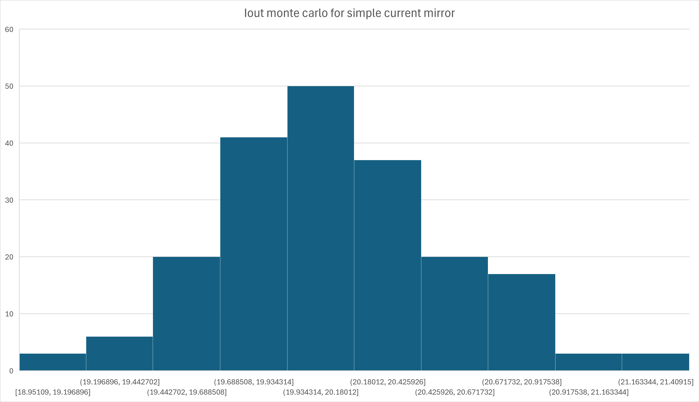
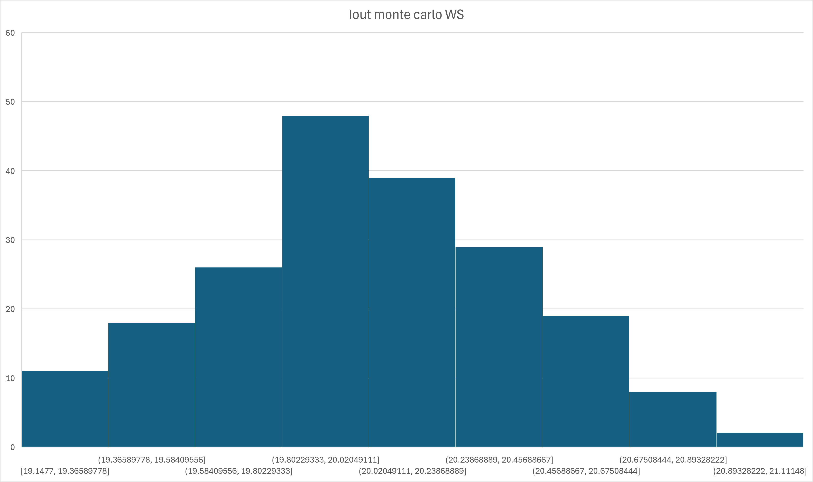

# Current-Mirror Monte Carlo Data

These CSV files contain the 200 simulated output-current samples used in the simple-versus-wide-swing current-mirror comparison. The original simulator values are preserved in amperes; sample indices and microampere values are added for convenient analysis.

| Dataset | Samples | Mean | Population standard deviation | Population CV |
|---|---:|---:|---:|---:|
| [simple-current-mirror.csv](simple-current-mirror.csv) | 200 | 20.118 uA | 0.423 uA | 2.10% |
| [wide-swing-current-mirror.csv](wide-swing-current-mirror.csv) | 200 | 20.025 uA | 0.394 uA | 1.97% |

Statistics were recomputed directly from the included samples using population standard deviation: sigma = sqrt(sum((x - mean)^2) / N), and population CV = 100 * sigma / mean.

<table>
  <tr>
    <td width="50%"></td>
    <td width="50%"></td>
  </tr>
  <tr>
    <td align="center"><strong>Simple current mirror</strong></td>
    <td align="center"><strong>Wide-swing cascode current mirror</strong></td>
  </tr>
</table>
