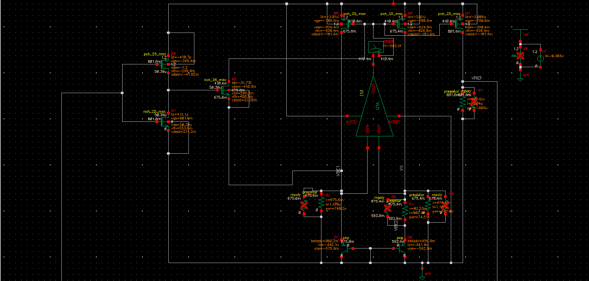
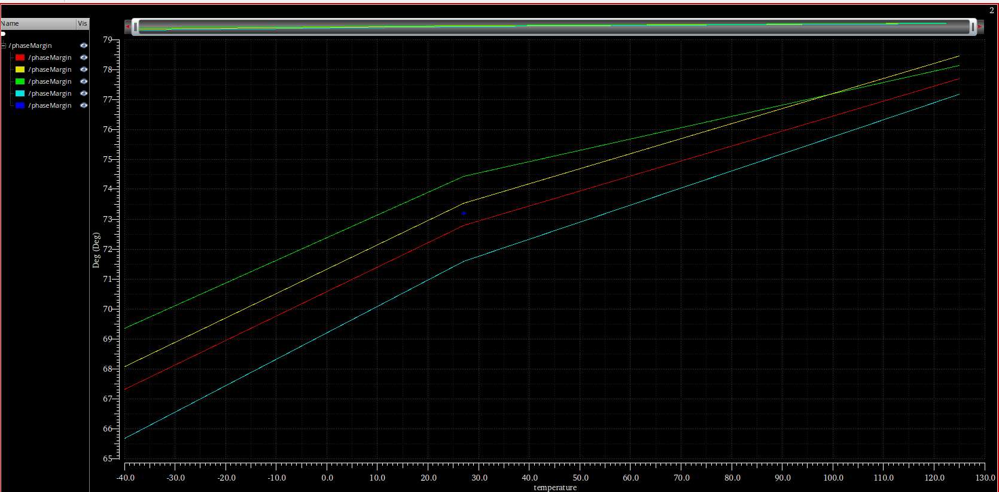
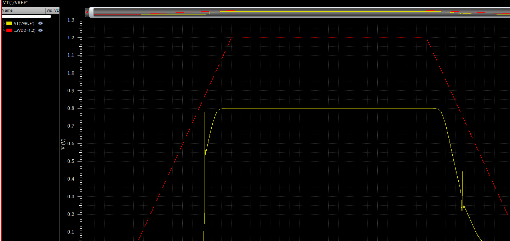

# Self-Biased Sub-1 V Bandgap Reference

This design challenge develops a self-biased reference around 0.8 V from a 1.2 V supply by combining a BJT CTAT voltage with a scaled PTAT delta-VBE term. A transistor-level OTA regulates the core, while resistor values are iteratively tuned for temperature flatness and reference level.

[Open the complete report](report.pdf)

## Part 2 - transistor OTA with ideal passives

| Metric | Source-checked result |
|---|---:|
| Supply voltage | 1.2 V |
| Nominal reference voltage | approximately 0.8016 V |
| Nominal total supply current | approximately 6.303 uA |
| Temperature sweep | -40 to 125 degrees C |
| Global corner/temperature spread | approximately 2.5 mV peak-to-peak |
| Phase margin across the evaluated sweep | approximately 65.7 to 78.5 degrees |
| Compensation capacitor | 10 pF |

## Part 3 - PDK passives

| Metric | Source-checked result |
|---|---:|
| Nominal reference voltage | approximately 0.8036 V |
| Nominal total supply current | approximately 9.162 uA |
| Global corner/temperature spread | approximately 3.25 mV peak-to-peak |
| Selected passives | RNpoly resistors and MIM capacitor |
| Final resistor values | R2 = 91.4 kohm, R3 = 627 kohm, R4 = 407 kohm |

## Design flow

1. Extract the BJT CTAT slope and calculate the PTAT delta-VBE term.
2. Estimate the resistor ratios required for a sub-1 V reference.
3. Size the current mirrors and OTA with mismatch and headroom in mind.
4. Replace the behavioral amplifier with the transistor-level OTA.
5. Tune PTAT/CTAT balance and the nominal reference level.
6. Verify the available MOS-process/temperature sweep, loop stability, and supply-ramp startup.

## Visual evidence

### Part 3 PDK-passive operating point

### Part 2 reference over temperature and corners

### Part 2 stability across corners

### Part 2 supply-ramp startup behavior

## Verification scope

The Part 2 plot spans approximately 799.4 to 801.9 mV across the displayed temperature/corner sweep, or about 2.5 mV peak-to-peak. The Part 3 PDK-passive plot has a wider global spread of approximately 3.25 mV and a nominal value near 0.8036 V. The available stability sweep applies to Part 2; phase margin is not established for the final PDK-passive implementation.

The available process-corner setup varies the MOS models while the BJT and passive models remain at TT. These results therefore document the evaluated setup rather than a full all-device PVT qualification. All values are simulated, not measured silicon data.
