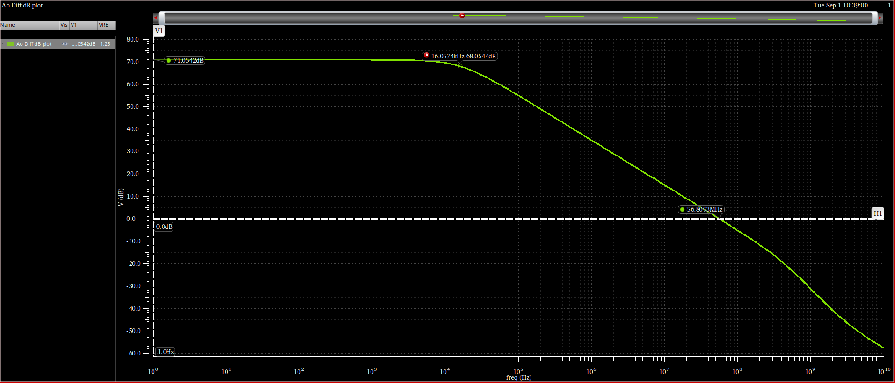
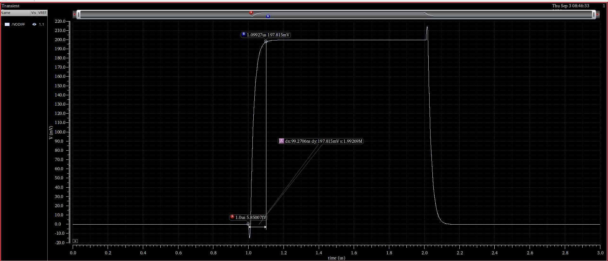

# Mini Project 02 - Fully Differential Folded-Cascode OTA

This portfolio presents Lab 11 as Mini Project 02. The project extends the gm/ID methodology to a fully differential folded-cascode OTA, first using behavioral common-mode feedback and then replacing it with a transistor-level sensing and error-amplifier loop.

[Open the complete PDF report](../../reports/cadence/11-fully-differential-folded-cascode-ota.pdf)

## Open-loop OTA with behavioral CMFB

| Metric | Hand analysis | Simulation |
|---|---:|---:|
| DC differential gain | 70.15 dB | 71.05 dB |
| Bandwidth | 18.65 kHz | 15.97 kHz |
| UGF | 59.97 MHz | 56.84 MHz |
| GBW | 59.97 MHz | 57.00 MHz |
| Phase margin | 90.02 degrees | 82.02 degrees |

## Closed-loop operation with transistor-level CMFB

| Metric | Reported simulation result |
|---|---:|
| Common-mode-loop GBW | 11.46 MHz |
| Common-mode-loop phase margin | 85.54 degrees |
| Differential-loop GBW | 7.977 MHz |
| Differential-loop phase margin | 88.97 degrees |
| 1% settling time | 99.27 ns |
| Closed-loop differential gain | 1.9969 V/V |
| Differential output swing | 1.198 Vpp |

## Design and verification flow

1. Size the folded-cascode signal path and bias network using gm/ID targets.
2. Verify the open-loop differential response with behavioral CMFB.
3. Design the common-mode sensing circuit and transistor-level error amplifier.
4. Evaluate the differential and common-mode loops independently with stability analysis.
5. Verify closed-loop gain, settling, common-mode recovery, and differential output swing.

## Visual evidence

### Transistor-level topology

### Open-loop response

### Settling response

## Verification scope

The report documents both differential-mode and common-mode-loop behavior and compares the available hand calculations with transistor-level simulations. All results are simulated for the documented models and conditions; they are not measured silicon data.
