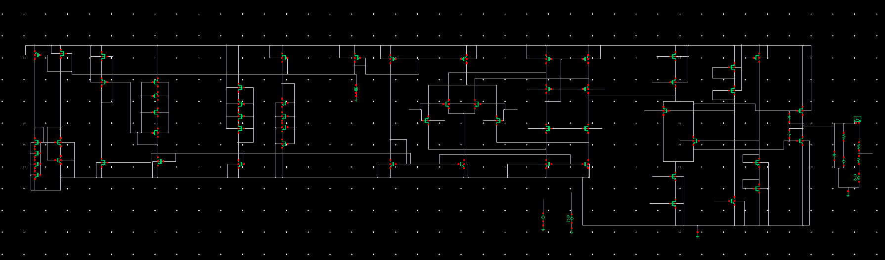
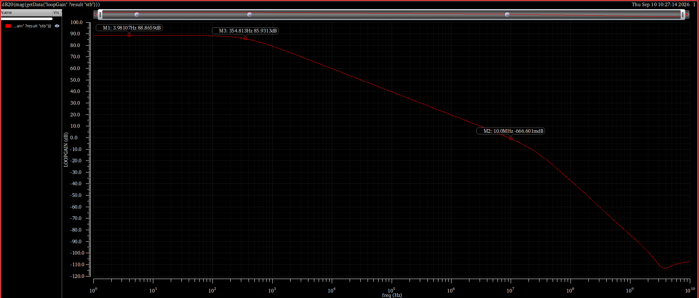
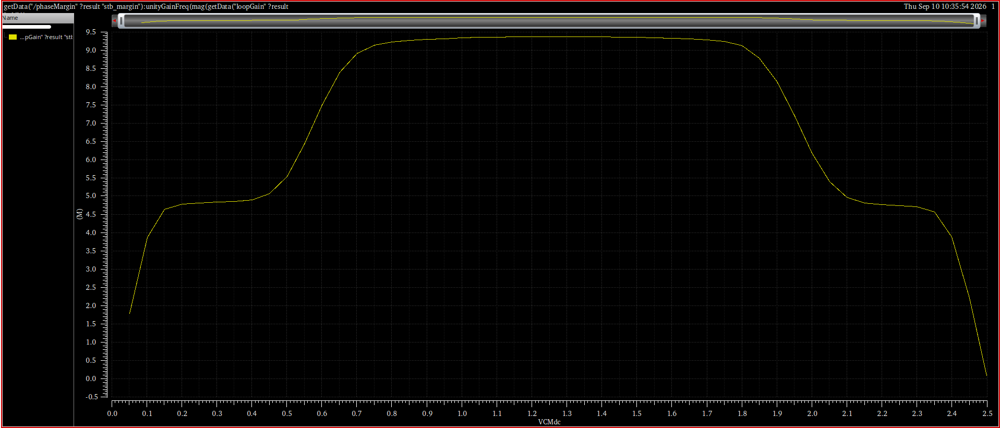
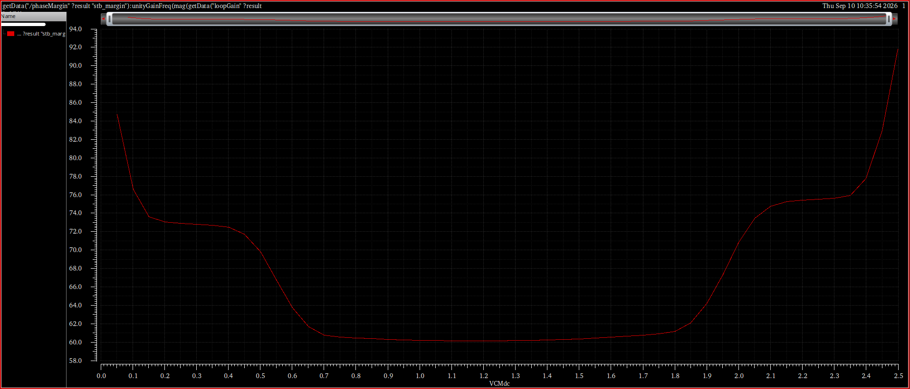
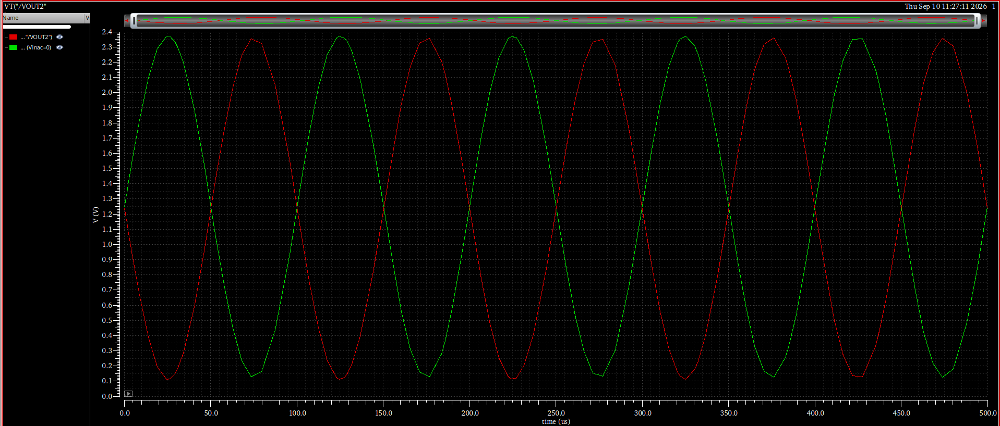

# Rail-to-Rail Input, Monticelli Class-AB Output Op Amp

> Status: preliminary nominal verification. The [compiled report](report.pdf) reconstructs the design evidence from archived screenshots and simulator logs; no simulations were rerun.

This 65 nm design challenge combines complementary rail-to-rail input stages, a folded-cascode signal path, Monticelli translinear-loop biasing, and a class-AB output stage. The primary test bench is a unity-gain buffer driving 10 kohm and 20 pF from a 2.5 V supply.

## Main schematic

Complete circuit overview supplied by the author. [Open the original-resolution schematic](../../assets/results/class-ab-schematic.png). The report features this image on its cover and as a dedicated landscape page. Device sizing labels are not readable in this view; annotated operating-point close-ups are preserved below and in the report.

## Latest nominal stability run

| Metric | Result | Target | Provenance |
|---|---:|---:|---|
| Low-frequency loop gain | approximately 88.9 dB at 3.98 Hz | greater than 60 dB | Separate annotated Bode plot |
| GBW | 10.11 MHz | greater than 10 MHz | Final archived log |
| Phase margin | 60.58 degrees | greater than 60 degrees | Final archived log |
| Input common-mode voltage | 1.25 V | mid-rail | Final archived log |
| Compensation capacitor | 1.65 pF | - | Final archived log |
| Simulation errors | 0 | 0 | Final archived log |

The GBW and phase margin only narrowly clear their targets at the latest nominal design point. The normalized [run record](evidence/latest-nominal-run.txt) preserves the exact final values found in the simulator log. A separate captured run reports 10.03 MHz GBW, 60.21 degrees phase margin, and 17.24 dB gain margin; those values are not merged with the final log above.

## Visual evidence

### Nominal loop gain

### Unity-gain frequency across input common-mode range

### Phase margin across input common-mode range

### Inverting gain-of-one sine response

## Verification scope

The input-common-mode sweep plots unity-gain frequency, not gain-bandwidth product. It shows a broad midrange plateau around 9.2 to 9.4 MHz and a sharp reduction near the rails, while phase margin is lowest near mid-rail. The screenshots also document DC transfer and output-current behavior for 10 kohm and 2 kohm loads, a positive slew rate of approximately 3.72 V/us, and non-inverting/inverting 10 kHz sine tests.

The archive does not establish PVT, Monte Carlo, mismatch, layout, post-layout, noise, THD, PSRR, or CMRR performance. A numerical negative slew-rate result is also unavailable. A complete schematic screenshot is now included as architectural evidence, while readable sizing annotations and a verified sizing table remain unavailable. The report remains a transparent evidence reconstruction, not a claim of production readiness.
