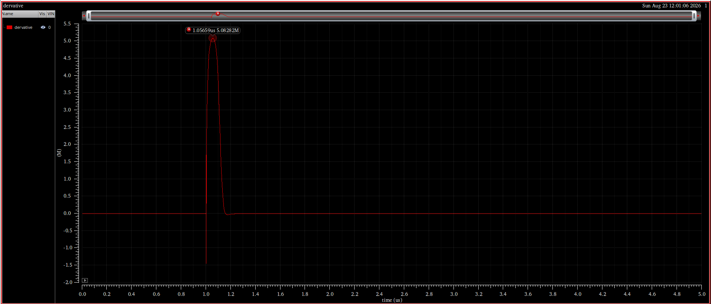

# Mini Project 01 - Two-Stage Miller-Compensated OTA

The course brief identifies Lab 09 as Mini Project 01. This project follows a complete gm/ID-based design flow for a two-stage, single-ended OTA intended for unity-gain buffering, from specification allocation and transistor sizing through open-loop and closed-loop verification.

[Open the complete PDF report](../../reports/cadence/09-two-stage-miller-ota.pdf)

## Selected results

| Metric | Hand analysis | Simulation |
|---|---:|---:|
| DC gain | 71.20 dB | 71.15 dB |
| Bandwidth | 1.717 kHz | 1.698 kHz |
| GBW | 6.231 MHz | 6.126 MHz |
| UGF | 6.350 MHz | 5.987 MHz |
| Phase margin | 77 degrees | 75.23 degrees |
| Slew rate | 5.00 V/us | 5.08 V/us |
| Settling time | 61.2 ns estimate | 38.8 ns |

## Design and verification flow

1. Generate and interpret gm/ID design curves for NMOS and PMOS devices.
2. Allocate gain, current, headroom, compensation, and common-mode requirements between the two stages.
3. Size the differential pair, current-mirror load, bias network, and common-source output stage.
4. Verify differential gain, common-mode gain, CMRR, output swing, and common-mode input range.
5. Close the loop as a unity-gain buffer and verify loop stability, slew rate, and settling.

## Visual evidence

### Open-loop response

### Slew-rate measurement

## Verification scope

The report compares hand analysis with transistor-level simulation and discusses the remaining differences. All values are simulated for the documented models and conditions; they are not measured silicon results.
